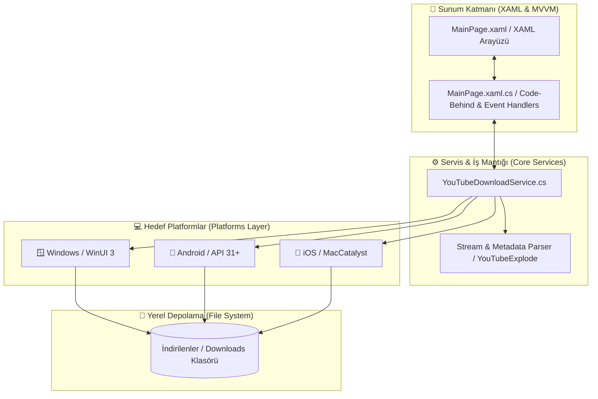
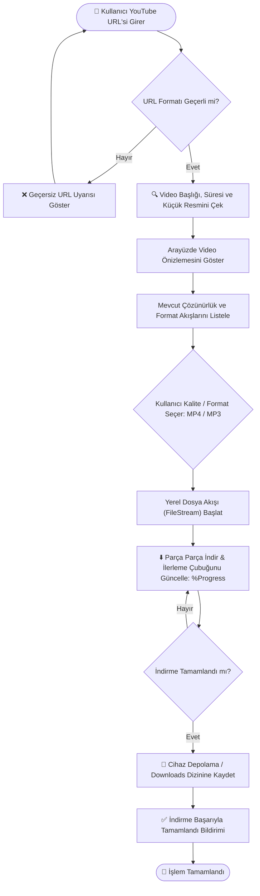
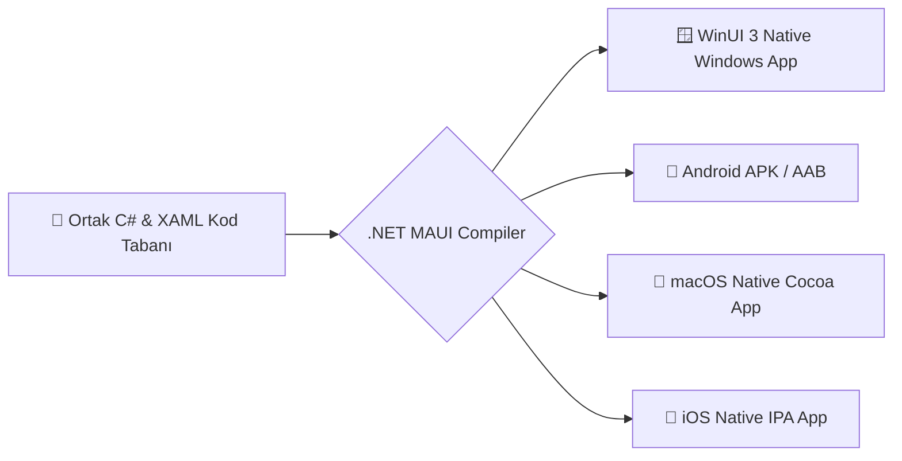

<div align="center">

# 🎬 .NET MAUI YouTube Downloader (okiyoutubeindirici)

**Tek bir C# kod tabanı üzerinden Windows, Android, iOS ve macOS platformlarında çalışan modern, reklamsız ve yerel YouTube video/ses indirme istemcisi.**

[](https://github.com/UmutGuvenUslu/.NET-Maui-Youtube-Downloader/actions)
[](LICENSE)
[](https://dotnet.microsoft.com/apps/maui)
[](CONTRIBUTING.md)
[](https://github.com/UmutGuvenUslu/.NET-Maui-Youtube-Downloader/stargazers)

<p align="center">
  <a href="#-neden-net-maui-youtube-downloader">Neden Bu Proje?</a> •
  <a href="#-uygulama-mimarisi-ve-katmanlar">Mimari Akış</a> •
  <a href="#-video-indirme-ve-akış-çözümleme-süreci-download-flow">İndirme Akışı</a> •
  <a href="#-platformlar-arası-çalışma-prensibi">Platform Mimarisi</a> •
  <a href="#-temel-özellikler">Özellikler</a> •
  <a href="#-kurulum-ve-çalıştırma">Kurulum</a> •
  <a href="#-proje-dizin-yapısı">Dizin Yapısı</a>
</p>

</div>

---

## 🎯 Neden .NET MAUI YouTube Downloader?

> **Problem:** Çevrimdışı içerik tüketimi veya arşivleme amacıyla video indirmek isteyen kullanıcılar çoğu zaman güvenilmez, yanıltıcı reklamlarla dolu üçüncü parti web sitelerine ya da yalnızca tek bir işletim sistemini destekleyen hantal araçlara mahkûm kalır.

**Çözüm:** **.NET-Maui-Youtube-Downloader**, Microsoft'un modern **.NET MAUI** altyapısını ve **YouTubeExplode** kütüphanesini kullanarak aracı sunucular olmadan doğrudan cihazınız üzerinden video ve ses akışlarını çeken, gizlilik odaklı, güvenli ve çok platformlu (Cross-Platform) bir çözümdür.

---

## 🧠 Uygulama Mimarisi ve Katmanlar

Uygulamanın XAML arayüzü, servis katmanı ve platform API'leri arasındaki haberleşme akışı:



---

## 🔄 Video İndirme ve Akış Çözümleme Süreci (Download Flow)

Bir bağlantının girilmesinden yerel diske yazılmasına kadar geçen işlem adımları:



---

## 🌐 Platformlar Arası Çalışma Prensibi

Tek bir C# kod tabanının farklı platform motorlarına derlenme mekanizması:



---

## ✨ Temel Özellikler

* 🌍 **Çok Platformlu Destek:** Tek bir kod tabanı üzerinden Windows, Android, macOS ve iOS üzerinde yerel (native) performans.
* ⚡ **Hızlı ve Güvenli İndirme:** Üçüncü parti sunucu gerektirmeksizin doğrudan YouTube sunucularından cihaza veri aktarımı.
* 🎚️ **Çözünürlük ve Format Seçimi:** İhtiyaca göre farklı video çözünürlükleri veya yalnızca ses (MP3/M4A) ayıklama imkânı.
* 📊 **Anlık İlerleme Takibi:** İndirme hızını ve yüzdesini gösteren dinamik durum çubuğu.
* 🎨 **Modern ve Sade UI:** Gereksiz karmaşıklıktan uzak, doğrudan sonuca odaklı XAML tasarımı.

---

## 🛠️ Teknik Altyapı

| Teknoloji / Kütüphane | Kullanım Amacı | Temel Avantaj |
| :--- | :--- | :--- |
| **.NET MAUI (C# / XAML)** | Çapraz Platform Uygulama Çerçevesi | Tek kod tabanı ile çoklu platform derleme ve yerel arayüz |
| **YouTubeExplode** | YouTube Veri ve Akış Motoru | YouTube API anahtarı gerektirmeden güvenilir metadata ve akış çekimi |
| **.NET 8 SDK** | Çalışma Zamanı & Derleme Altyapısı | Yüksek asenkron G/Ç performansı ve modern C# dil özellikleri |

---

## 📂 Proje Dizin Yapısı

```plaintext
.NET-Maui-Youtube-Downloader/
├── 📄 .gitattributes
├── 📄 .gitignore
├── 📄 LICENSE
├── 📄 README.md
├── 📄 okiyoutubeindirici.sln                  # Visual Studio Solution dosyası
└── 📁 okiyoutubeindirici/
    ├── 📄 App.xaml / App.xaml.cs             # Uygulama kaynakları ve yaşam döngüsü
    ├── 📄 MauiProgram.cs                     # Dependency Injection ve MAUI App builder
    ├── 📄 MainPage.xaml / MainPage.xaml.cs   # Ana kullanıcı arayüzü ve indirme kontrolleri
    ├── 📄 okiyoutubeindirici.csproj          # Proje bağımlılıkları ve hedef platform ayarları
    ├── 📁 Platforms/                         # Platformlara özel yapılandırmalar
    │   ├── 📁 Android/                       # AndroidManifest ve Activity yapıları
    │   ├── 📁 iOS/                           # Info.plist ve AppDelegate
    │   ├── 📁 MacCatalyst/                   # macOS Catalyst konfigürasyonları
    │   └── 📁 Windows/                       # WinUI 3 uygulama giriş noktası
    ├── 📁 Resources/                         # Görseller, ikonlar, yazı tipleri ve raw varlıklar
    │   ├── 📁 AppIcon/
    │   ├── 📁 Fonts/
    │   ├── 📁 Images/
    │   └── 📁 Raw/
    └── 📁 Services/                          # İş mantığı ve YouTube entegrasyonu
        └── 📄 YouTubeDownloadService.cs      # İndirme, parse ve akış servis metotları
```

---

## 🚀 Kurulum ve Çalıştırma

### Gereksinimler

* **[.NET 8 SDK](https://dotnet.microsoft.com/download/dotnet/8.0)** veya üzeri.
* **[Visual Studio 2022](https://visualstudio.microsoft.com/)** (".NET Multi-platform App UI development" iş yükü seçili olmalıdır) veya **VS Code** (.NET MAUI ve C# Dev Kit eklentileri ile).

---

### Kurulum Adımları

1. **Repoyu Klonlayın:**
   ```bash
   git clone [https://github.com/UmutGuvenUslu/.NET-Maui-Youtube-Downloader.git](https://github.com/UmutGuvenUslu/.NET-Maui-Youtube-Downloader.git)
   cd .NET-Maui-Youtube-Downloader
   ```

2. **Çözümü Visual Studio ile Açın:**
   `okiyoutubeindirici.sln` dosyasına çift tıklayarak projeyi Visual Studio'da açın.

3. **Bağımlılıkları Geri Yükleyin:**
   ```bash
   dotnet restore okiyoutubeindirici.sln
   ```

4. **Hedef Platformu Seçin ve Çalıştırın:**
   * Visual Studio araç çubuğundaki hedef platform menüsünden **Windows Machine**, **Android Emulator** veya **iOS Simulator** seçeneğini belirleyin.
   * **F5** tuşuna basarak veya `Run` butonuna tıklayarak uygulamayı derleyip başlatın.

---

## 🤝 Katkıda Bulunma

Projeyi geliştirmeye katkıda bulunmak için:

1. Repoyu Fork'layın (`Fork`)
2. Yeni bir özellik dalı açın (`git checkout -b feature/YeniIndirmeSecenegi`)
3. Değişikliklerinizi commit edin (`git commit -m 'feat: Çalma listesi indirme desteği eklendi'`)
4. Dalınıza push yapın (`git push origin feature/YeniIndirmeSecenegi`)
5. Bir **Pull Request** açın

---

<div align="center">

Geliştirici: **[Umut Güven Uslu](https://github.com/UmutGuvenUslu)**

⭐ Projeyi beğendiyseniz yıldız vermeyi unutmayın!

</div>
